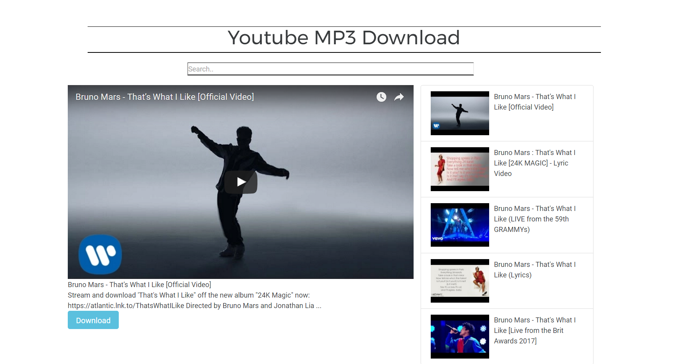

# :memo: YoutubeReactMP3Downloader: 

## Overview

This is a web app that allows users to search any youtube video and download it as an mp3 file.

It was built with react, redux, node

Please try out the deployed app in Heroku, found [here](https://youtubeviewerreact.herokuapp.com/).

## Functionality
On the Front End, the app uses `React` JavaScript Framework with `React Router` and `Redux`. And for styling, the `Bootsrap 4`.

On the Back End, the app uses`NodeJS`. Naturally, `Express` is used as the router.

## Screenshots

### Landing Page

### Download in action

### Another Search

